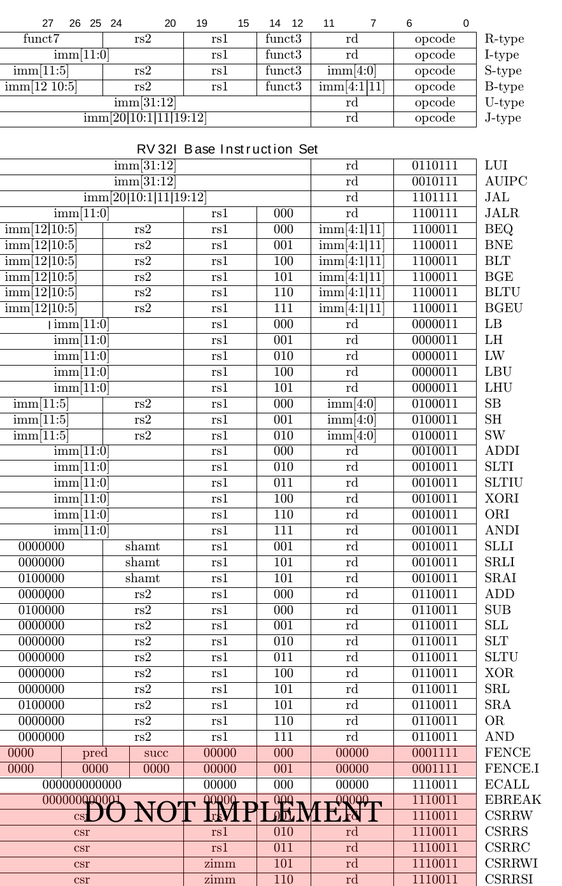

## Pipelined 5-stage RISC-V processor

This project involves the development of a fully pipelined 5-stage RISC-V core that handles instruction fetching, decoding, execution, memory access, and write-back stages, with two different memories for instruction and data. 

### Pipelined Execution
Support for pipelined execution has been done using bypassing and stalling. 

### Bypassing

Bypassing in the following paths are supported:
- From the memory stage to the execute stage (MX).
- From the writeback stage to the execute stage (WX).
- From the writeback stage to the memory stage (WM).
- Bypassing allowed into branch comparator at the EX stage.
- No bypassing into decode stage.

### Stalling

Read-after-write (RAW) hazards between the decode stage and later stages have been eliminated by adding a stalling unit.


### Supported Instructions:




## Tests and Troubleshooting

Basic tests for signal presence and basic timing correctness.

- `test_pd`: Tests for basic signal presence and to generate trace files. It does not check correctness properties.
- `test_pre_check`: Tests the initialization properties of modules.
- `test_rf_init`: Tests the initialization of the register file. Run this test with:  ```make -s run TEST=test_rf_init MEM_PATH=../data/read_rf.x```

To run the above tests, move into `verif/scripts` and use the following command:

```bash
make -s run [TEST=<test_name>] [MEM_PATH=<mem_path>]
```

### Debugging

To plot waves useful for debugging the design across cycles, use the following command to open up `gtkwave`:

```bash
make waves [MEM_PATH=<mem_path>]
```