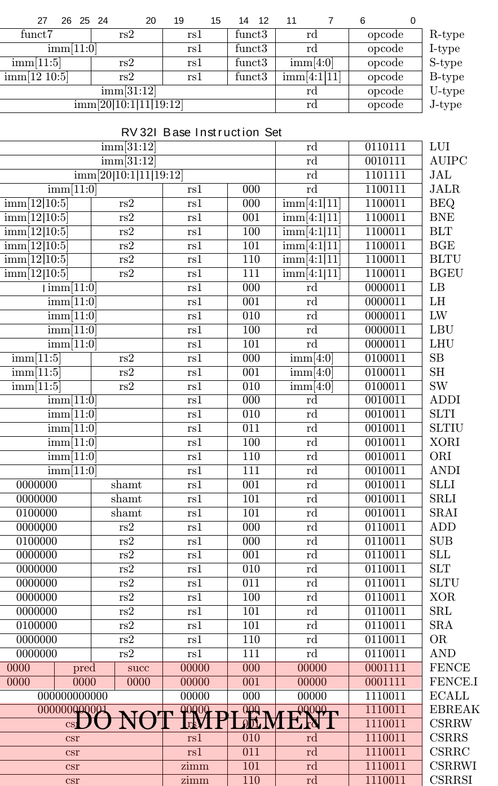

# PD2: Decode Stage

This document guides you through the completion of your decode stage.

**Deadline**: Sunday, February 4th, 2024 at 11:59 PM

**Weight**: 3% of total lab grade

## Environment Setup

### Getting the repository

Use `git` to clone the repository to your Linux environment. This can be done using:

```bash
git clone ist-git@git.uwaterloo.ca:ece621-w24/project/revalenz-pd2.git && cd revalenz-pd2 && ./install-hooks.sh
```

The `./install-hooks.sh` command installs a pre-push hook in your local repository to remind you to add/clear files before pushing.

### Setup of simulators and environment variables

Go to the root of the project repository and execute the command `source env.sh`.
You should get the information similar to the following.
Note that you will need to perform this operation every time you use a different `bash` session.
Otherwise, the scripts will not be able to locate the files.

```bash
$ source env.sh
===== Computer Architecture Course Environment Setup =====
Important: this script should be used as `source env.sh` and should only be used in bash
Project Root ($PROJECT_ROOT):		/home/your/path/to/repo
verilator Version ($VERILATOR_VERSION):	 Verilator 4.210 2021-07-07 rev v4.210
Vivado Version ($VIVADO_VERSION): 	 Vivado v2022.1 (64-bit)
===== Computer Architecture Course Environment Done  =====
```

If the script is unable to locate the verilator or vivado version, the corresponding line will be empty.

## Specification

In this PD, you will be using the data output from the instruction memory and decoding it in the decode stage.
Make sure to copy your `imemory` implementation from PD1.
The decode stage splits the instruction word into its respective fields.
This allows the hardware to identify the instruction, its operands, and generate any control signals that may be necessary to drive other datapath components.
This decode stage must be combinational.
Connect the decode stage to the fetch logic.
The decode stage should support all the instructions shown in the table below:



Not all instructions have a value for all fields.
For those values, you may assign any value and we will treat it as a don't care.
Make sure to properly sign extend and pad the immediate value field.

## Probes

You will need to fill in `design/signals.h` with your signal names in `design/code/pd.v` to wire up the probes.
The new probes are as follows:

```verilog
`define D_PC                ??? // The PC you use in the decode stage. Before we introduce any pipelining, this can be the same as F_PC.
`define D_OPCODE            ???
`define D_RD                ???
`define D_RS1               ???
`define D_RS2               ???
`define D_FUNCT3            ???
`define D_FUNCT7            ???
`define D_IMM               ???
`define D_SHAMT             ???
```

Besides `D_PC`, the remaining probes match the naming convention in the table above.
They should be the output of your decode logic.

## Tests

We provide simple tests that test for signal presence and basic timing correctness.

- `test_pd`: Tests for basic signal presence and to generate trace files (see below).  Note that `test_pd` does not check correctness properties, so it does not output `Test passed` even if it successfully completes.
- `test_pre_check`: Tests the initialization properties of your `imemory`

To run these tests, go to `verif/scripts` and use the following command:

```bash
make -s run [TEST=<test_name>] [MEM_PATH=<mem_path>]
```

If you do not supply a `TEST`, the command will default to the `test_pd` test.
We use the [rv32-benchmarks](https://git.uwaterloo.ca/ece621-w24/rv32-benchmarks) to test your design.
The path to the input `.x` file is provided to you as a macro of string named `MEM_PATH`.
You can set this macro when you run `make` to test different benchmarks.

We will be using trace files to output signal values at each pipeline stage every clock cycle.
For PD2, we will output information from the fetch and decode stages.
If it doesn't encounter any errors, the `test_pd` test will generate a `.trace` file for a given benchmark located in `verif/sim/verilator/test_pd/`.
This time, your output will consist of two lines for each instruction: fetch `[F]` and decode `[D]`.
The `[D]` lines will be formatted as `[D] pc_address opcode rd rs1 rs2 funct3 funct7 imm shamt` in hexadecimal format.
For example, the `sub x1, x2, x3` at address `0x01000004`, you should see an output like `[D] 01000004 33 1 2 3 0 0 0 0`.

For PD2, we provide you with the first 750 lines of the golden trace files for the individual instruction benchmarks in `verif/golden`.
Make sure that your output lines up with these.

## Testbench

Apart from the tests we provided, you may write your own testbenches.
This is not required, but may help you find new bugs that the other tests cannot find.

You need to place your testbench in a module called `top`, located in `verif/tests/` (e.g. `verif/tests/test_my_pd.v`).
You may refer to `test_pd.v` and extend from that file.
By creating `test_my_pd.v`, you will be able to run the test in `verif/scripts` using `make run TEST=test_my_pd`.
Make sure that your design does not report any warning during compilation.

We provide the verilator `verif/tests/test_pd.cpp` that drives your testbench. 
However, your testbench should not depend on any modifications to the `test_pd.cpp`.

## Troubleshooting your Design

You may be tempted to rely on `$display()` tasks to debug your design.
However, it can be difficult to determine when signals change value with these statements.
Instead, you can plot the waves using `gtkwave`.
We have provided a Makefile target to do this:

```bash
make waves [MEM_PATH=<mem_path>]
```

You can edit `verif/scripts/waves.tcl` to automatically add specific signals to your screen, group signals together, set colours and zoom level, etc.
If you would like to do this Appendix C in the project deliverables document on LEARN.

Remember that if you add any verilog files to `design/code`, be sure to add them to `verif/scripts/design.f`.

## Submission

The following are deliverables for PD2.

1. Implement the decode logic to determine the
   - opcode,
   - source and destination registers,
   - funct3,
   - funct7, and
   - immediate
2. Instantiate your decode module in `design/code/pd.v`.
3. Add probe mappings to `design/signals.h`.
4. Make sure that your trace files are consistent with those in `verif/golden`.

When you are finished, remember to commit and push your changes to your GitLab repository.
Be sure to execute `git add <PATH(S) TO NEW FILE(S)>` if you add any new files before committing your changes.

```bash
git commit -am "<message>"
git push origin master
```

Your most recently pushed code prior to the deadline will be treated as your submission when we grade.

## Credits


The project structure heavily borrows the AWS EC2 FPGA HDK structure, [see here](https://github.com/aws/aws-fpga).

